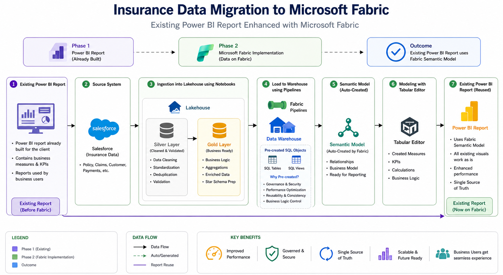

# 🚀 Insurance Data Migration to Microsoft Fabric

## 📌 Overview

This project demonstrates a real-world scenario where an existing Power BI solution was successfully migrated and enhanced using Microsoft Fabric.

Initially, a Power BI report was developed for an insurance client. After the launch of Microsoft Fabric, the client wanted to centralize and modernize their entire data platform. This project showcases how their data was migrated from Salesforce into Fabric, transformed, and integrated with the existing reporting solution.

---

## 🏗️ Architecture

  

---

## 🔄 Project Journey

### 🔹 Phase 1: Existing Setup

* Power BI report was already built for the client
* Contained business logic, KPIs, and measures
* Used by business users for reporting

---

### 🔹 Phase 2: Microsoft Fabric Implementation

#### 1. **Data Source**

* Insurance data coming from Salesforce
* Includes policies, claims, customers, Dealers and Reservers

---

#### 2. **Data Ingestion (Lakehouse)**

* Data ingested into Fabric Lakehouse using Python Notebooks(runs automatically)
* Implemented Medallion Architecture:

  * **Silver Layer** → Data cleaning, validation, standardization
  * **Gold Layer** → Business-ready data with aggregations

---

#### 3. **Data Warehouse (via Pipelines)**

* Data moved from Lakehouse to Warehouse using Fabric Pipelines
* Pipelines are scheduled and run automatically to ensure continuous data flow  

---

#### 4. **Semantic Model (Auto-generated)**

- Fabric automatically creates a semantic model from the warehouse  
- Basic relationships may be inferred automatically  
- Relationships and business logic are reviewed and refined manually

---

#### 5. **Measure Management (Tabular Editor)**

* Existing Power BI report already had measures
* Recreated and managed measures using Tabular Editor
* Ensured compatibility with new Fabric semantic model

---

#### 6. **Power BI Integration**

* Existing Power BI report reused
* Connected to Fabric semantic model
* All visuals continued to work seamlessly

---

## 📊 Key Features

* End-to-end data pipeline using Microsoft Fabric
* Integration with Salesforce data source
* Medallion architecture (Silver & Gold layers)
* Automated data movement using pipelines
* Pre-defined warehouse schema for performance optimization
* Reuse of existing Power BI reports
* Measure management using Tabular Editor
* Scalable and production-ready design

---

## 🎯 Outcome

* Successfully migrated legacy reporting system to Microsoft Fabric
* Achieved a **single source of truth**
* Improved performance and scalability
* Minimal changes required in existing Power BI reports
* Faster and more efficient data processing

---

## 💡 Use Case

This solution is applicable for:

* Insurance analytics platforms
* Data modernization projects
* Migrating legacy BI systems to Microsoft Fabric
* Organizations looking to centralize data and reporting

---

## 🛠️ Tech Stack

* Microsoft Fabric
* Lakehouse
* Data Warehouse
* Data Pipelines
* Power BI
* Tabular Editor
* Salesforce (Data Source)

---

